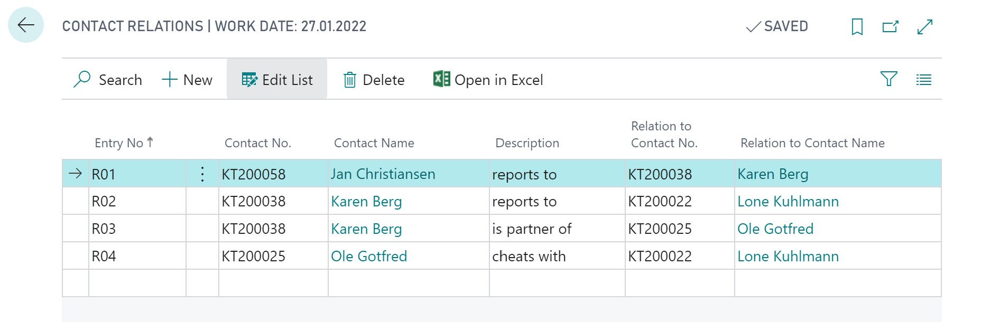

# Business Central: Navigation in Webservices and API
This is a spike project to explore both the REST Webservices and the new custom API of Business Central. My interest here is especially in the O-Data navigation features. I would like to query whole entity trees with only  a single call using $expand. The [documentation](https://docs.microsoft.com/en-us/dynamics365/business-central/dev-itpro/webservices/use-containments-associations) I have found so far on the subject is extremely scarce and also outdated.  
## Setup
### A simple relation beween contacts

For this purpose, there is a simple table called `Tab50100.ContactRelation`.

``` AL
table 50100 "Contact Relation"
{
    Caption = 'Contact Relation';
    DataClassification = CustomerContent;

    fields
    {
        field(1; "No."; Code[10])
        {
            DataClassification = CustomerContent;
        }
        field(2; "Contact No."; Code[20])
        {
            TableRelation = Contact ."No.";
        }
        field(3; "Relation to Contact No."; Code[20])
        {
            TableRelation = Contact."No.";
        }
        field(4; "Description"; Text[50])
        {
            DataClassification = CustomerContent;
        }
        /* ...and some flow fields for convienience ... */
    }
    keys { key(PK; "No."){}}
}
```
For each contact a list of their relationships (e.g. "Child" or "Partner of") to other contacts can now be stored. Therefore the table contains the two fields `Contact No` and `Relation to Contact No.` which handle the table relations to the built in table `Contact` (5050).

### A Page for Editing

For a basic editing UI, I created a page of type list `Page50101.ContactRelation`:

``` AL
page 50101 "Contact Relation"
{
    ApplicationArea = All;
    Caption = 'Contact Relations';
    PageType = List;
    SourceTable = "Contact Relation";
    UsageCategory = Lists;

    layout
    {
        area(content)
        {
            repeater(General)
            {
                field("No."; "No.")
                {
                    ApplicationArea = All;
                }
                field("Contact No."; "Contact No.")
                {
                    ApplicationArea = All;
                }
                field("Description"; Description)
                {
                    ApplicationArea = All;
                }
                field("Relation to Contact No."; "Relation to Contact No.")
                {
                    ApplicationArea = All;
                }
            }
        }
    }
}
```
This allows me to enter a few relations:   



## OData Web Services
Business Central allows to [publish page and queries](https://docs.microsoft.com/en-us/dynamics365/business-central/dev-itpro/webservices/publish-web-service) as OData Web Services. 
To publish the page above, I navigate to the page `Web Services`, add a new one, and select page 50101 ContactRelation. Service name is also set to ContactRelatition. After enabling, the service is available directly and can be queried.   

A get request to`{{serviceurl}}/ODataV4/Company('{{company}}')/ContactRelation` retrieves all entered contact relations as JSON. [Query options](https://www.odata.org/getting-started/basic-tutorial/#queryData) like `$filter` and `$select` allows to optimize requests. 

Part of OData is also the ability to obtain the Enitity Data Model. The metadata is available at the service root with the url `{{serviceurl}}/ODataV4/$metadata`. That document is an XML-based file format.

It also contains now our definition of Contact Relations:

```xml
<EntityType Name="ContactRelation">
    <Key>
        <PropertyRef Name="No" />
    </Key>
    <Property Name="No" Type="Edm.String" Nullable="false" MaxLength="10">
        <Annotation Term="NAV.LabelId" String="No" />
        <Annotation Term="NAV.NavType">
            <EnumMember>NAV.NavType/String</EnumMember>
        </Annotation>
        <Annotation Term="NAV.AllowEditOnCreate" Bool="true" />
    </Property>
    <Property Name="Contact_No" Type="Edm.String" MaxLength="20">
        <Annotation Term="NAV.LabelId" String="Contact_No" />
        <Annotation Term="NAV.NavType">
            <EnumMember>NAV.NavType/String</EnumMember>
        </Annotation>
    </Property>
    <Property Name="Description" Type="Edm.String" MaxLength="50">
        <Annotation Term="NAV.LabelId" String="Description" />
        <Annotation Term="NAV.NavType">
            <EnumMember>NAV.NavType/String</EnumMember>
        </Annotation>
    </Property>
    <Property Name="Relation_to_Contact_No" Type="Edm.String" MaxLength="20">
        <Annotation Term="NAV.LabelId" String="Relation_to_Contact_No" />
        <Annotation Term="NAV.NavType">
            <EnumMember>NAV.NavType/String</EnumMember>
        </Annotation>
    </Property>
    <Annotation Term="NAV.LabelId" String="ContactRelation" />
</EntityType>
```

The name of the entity type is defined by the name of the service and not py the name of page or table. Fields are renamed to its Pascal case representation.

### Associations

OData also allows to include related resources within one single request using the query option `$expand`. In case of contact relations, it would be nice to include the contacts for Contact_No and Relation_to_Contact_No.

Both fields are defined as `Table Relation`s to the contact table. That contact table, which is part of Busines Central, has a property `LookupPageID` which is set to `"Contact List"` (ID 5052).

This page needs to be published as webservice with the service name `Contact`. Afterwards the metadata has changed. It doesn't not only contains the entity type Contact, but it also adds navigation properties to the entit type ContactRelation:

```xml
<EntityType Name="ContactRelation">
    ...
    <NavigationProperty Name="Contact_No_Link" Type="Collection(NAV.Contact)" ContainsTarget="true" />
    <NavigationProperty Name="Relation_to_Contact_No_Link" Type="Collection(NAV.Contact)" ContainsTarget="true" />
    ...
</EntityType>
```

These association have the name of the field with the table relation folloewd by `_Link`. PLease note the type of the navigation property. While a table relation is a look up, which points to a single entity, the type indicates a _collection_ of type Contact.

`...ContactRelation('R01')?$expand=Relation_to_Contact_No_Link, Contact_No_Link` will return for our example data: 

``` js
{
    "@odata.context": "{{serviceurl}}/$metadata#Company('{{company}}')/ContactRelation/$entity",
    "@odata.etag": "W/\"JzQ0O29SbGVDYm93dW5lbDBVVjlFcUdDV0EyVHF2V2R3Z3RUWml2NHVSZTZYcUU9MTswMDsn\"",
    "No": "R01",
    "Contact_No": "KT200058",
    "Description": "reports to",
    "Relation_to_Contact_No": "KT200038",
    "Contact_No_Link": [
        {
            "@odata.etag": "W/\"JzQ0O1RkTWthTXZ6SzNBNGJrY3hmeDZKTzFMaXBGUVpSMVRTeWoreWtjZ056YlU9MTswMDsn\"",
            "No": "KT200058",
            "Name": "Jan Christiansen",
            //... more fields
        }
    ],
    "Relation_to_Contact_No_Link": [
        {
            "@odata.etag": "W/\"JzQ0O3gwV05ZaVMyVElhTFgzZjVwWVVUdXhNUm92TWt4QWZqR2twQURVYTBIOHc9MTswMDsn\"",
            "No": "KT200038",
            "Name": "Karen Berg",
            //... more fields
        }
    ]
}

```
### Containments
